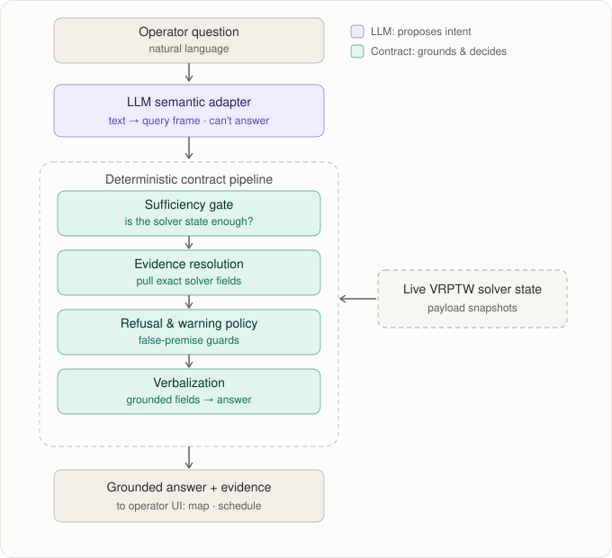
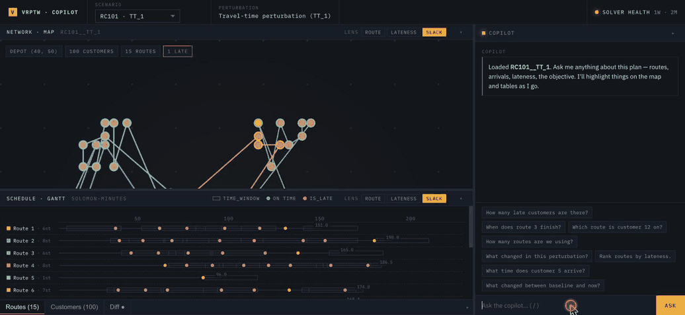

# Routing Copilot

[](https://github.com/juandifers/copilot-opt/actions/workflows/tests.yml)

**A payload contract for an LLM copilot over a live optimization backend** — implemented here over a VRPTW solver, though the architecture generalizes to any structured backend whose state changes faster than a corpus.

A dispatcher's natural-language question is translated by the LLM into a structured intent. A deterministic contract pipeline grounds that intent against the solver's live state: decides whether the state can support an answer, resolves the answer from real fields, applies refusal and warning policy, and verbalizes the result. Every claim the operator sees is anchored to evidence; the LLM never writes the answer.



## Demo



*The operator asks grounded questions and watches the UI respond — intent driving lens, selection, and panel focus deterministically. Here: a lateness check answered from the payload, an open-ended "what should I keep an eye on?" mapped by the LLM to a grounded watch-list, and a route-timing question that highlights the route on both the network map and the Gantt.*

## What is a payload contract?

The same retrieval-and-ground pattern as RAG, applied to the structured state of a live optimization backend rather than a corpus of documents — and extended with one mechanism classical RAG lacks: a *sufficiency gate* that decides whether the retrieved state can support the question before any generation happens.

A **payload contract** is a typed, deterministic specification of what the system reads from the solver's live state to answer each kind of question, and what counts as a sufficient answer. The LLM's contribution is bounded to producing an `Intent` and any entity references — schema-validated, rejected on disagreement with deterministic priors. Everything else — answerability, evidence resolution, refusal policy, verbalization, and the visual-action hints that drive the UI — is owned by code, not the model. The LLM *proposes*; the contract *disposes*.

## How it works

```
operator question
     │
     ▼
[LLM semantic adapter]   text → query frame (intent + entities). schema-validated.
     │
     ▼
[Sufficiency gate]       can the live solver state support this question?
     │
     ▼
[Evidence resolution]    pull the exact solver fields that ground the answer.
     │
     ▼
[Refusal & warning]      false-premise guards, ambiguity warnings.
     │
     ▼
[Verbalization]          turn grounded fields into operator-facing text.
     │
     ▼
grounded answer + evidence + visual actions  →  operator UI
```

A separate inference step, `infer_visual_actions(intent, evidence)`, derives per-intent UI hints — which lens to activate, which entities to highlight, which panel to focus — from the same contract output. The frontend renders highlights from those hints deterministically; it does not re-derive them from the answer text. The mapping is specified in [`docs/highlight_contract.md`](docs/highlight_contract.md).

## An interaction

Every claim is traceable to a real solver field:

```
Q: "What am I looking at?"

intent:        scenario_summary
answerability: answerable
behavior:      direct_answer
answer:        "This scenario is instance C202 under a time-window
                perturbation. Tightened windows make on-time delivery
                harder. Objective 591.6."
evidence:      explanation_context.scenario_id        = "C202__TW_3"
               explanation_context.instance.instance_id = "C202"
```

When the live state can't support the question, the system refuses and tells the operator what would change that:

```
Q: "If travel times got 10% worse, would we survive?"

intent:        unknown
answerability: not_answerable
behavior:      useful_refusal
answer:        "This question cannot be answered from the current payload."
next action:   "Narrow the question to a specific customer, route, or claim
                type, or pick a field from the available payload fields list."
```

The current solver snapshot contains no perturbed-travel-time scenario; the system says so. It does not invent a survival estimate.

## Why this design

A dispatcher acting on a hallucinated route summary is a real operational failure, not a chat experience problem. The system's guarantee is therefore not "sounds helpful" but "states nothing the solver's live state doesn't support." Putting the LLM on a leash is what makes that guarantee hold while still letting the LLM do the one thing it's well-suited to: interpreting messy natural language.

## Results

On a 109-query operator corpus written to mirror how dispatchers actually phrase things, enabling the LLM adapter lifts genuinely useful answers from **40% to 62%** over the deterministic-only baseline. On the 62 queries where the LLM changed the outcome, it **helped 24 and hurt 3** — the contract layer absorbs most of what the LLM gets wrong before it reaches the operator.

A separate 60-case benchmark shows the reliability gradient the architecture is built around. Pass@k (same query, k samples, all must succeed) climbs as control moves from the model to the contract:

| Configuration | pass@k |
|---|---|
| Prompt-only LLM | 0.30 |
| Hybrid (deterministic prior + LLM) | 0.50 |
| Contract-grounded | 1.00 |

*(k differs between rows — 5, 3, and by-construction respectively — read the direction, not the exact gap.)*

Where results are weak, plainly: action-recommendation queries are near-useless (~0% useful) and risk/fragility questions land near 13%. Most of those failures are intent-classifier misroutes rather than contract-grounding errors — diagnosed case by case rather than averaged away. The honest per-category breakdown lives in [`docs/results.md`](docs/results.md), and the full evaluation reports under [`product/evaluation/reports/`](product/evaluation/reports/).

## What this project demonstrates

- **An opaque backend made interrogable in the field.** A constraint solver's output is structured state an operator cannot read directly. Routing Copilot is the layer that exposes it safely.
- **An LLM system designed not to bluff.** Grounding every claim in a real field and refusing rather than fabricating is an architectural property, not a prompt patch.

## Repo map

| Path | What's here |
|---|---|
| [`product/`](product/) | The system. `api/` (FastAPI), `copilot/` (the contract pipeline — semantic adapter, sufficiency gate, refusal policy, verbalization), `data/` (payload projection, evidence resolution, answerability), `evaluation/` (runners + reports). |
| [`frontend/`](frontend/) | React + Vite operator UI — copilot panel, route map, schedule, evidence panel, intent-driven highlighting. |
| [`docs/`](docs/) | Architecture diagram, highlight contract, threshold rationale, reproducibility guide, results writeup. |
| [`tests/`](tests/) | ~1,200 tests; the thesis-load-bearing subset is pinned. |
| `experiment/`, `instances/`, `logs/`, `src/` | Scenario data, solver instances, runtime telemetry, and the original Stage-A benchmark package. Load-bearing for the API and for reproducing results — not where the product logic lives. |
| [`research/`](research/) | Earlier experimental phases and engineering notes, kept for history. |

## Run it locally

```bash
# Backend (Python 3.10+)
pip install -r requirements.txt
pip install -e .
cp .env.example .env          # add OPENAI_API_KEY for the LLM path
uvicorn product.api.app:app --reload

# Frontend (Node 18+)
cd frontend
npm install
npm run dev
```

The deterministic path, sufficiency gate, evidence resolution, refusals, runs **without an API key**. The key is only required for the LLM semantic adapter.

## Reproduce the evaluation

No setup required; reads the frozen reports and prints the headline numbers:

```bash
python -m product.evaluation.verify_reports
python -m product.evaluation.verify_reports --per-category
```

Re-running the deterministic configuration is bit exact; the LLM configurations are subject to roughly ±3pp model variance. Details in [`docs/reproducing_results.md`](docs/reproducing_results.md).

## Stack

Python · FastAPI · Pydantic · OpenAI API · PyVRP · React · TypeScript · Vite · Plotly · React Flow

## Origins

Originated as the bachelor's thesis *Payload Contracts for LLM Copilots in Vehicle Routing*. The original thesis README is preserved at [`docs/README_thesis_original.md`](docs/README_thesis_original.md).
